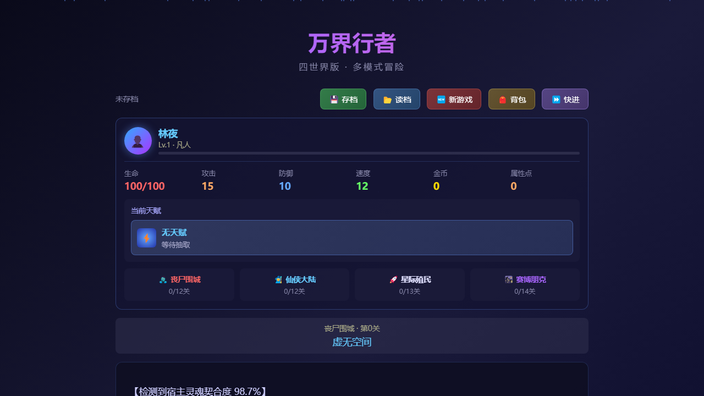
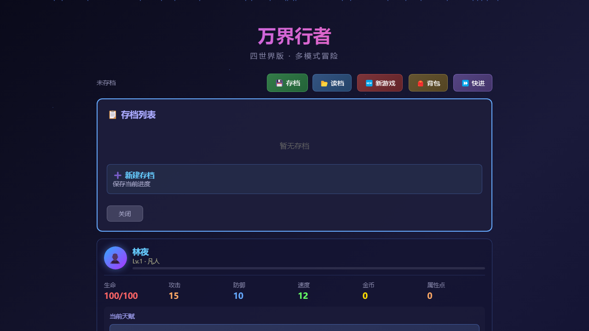
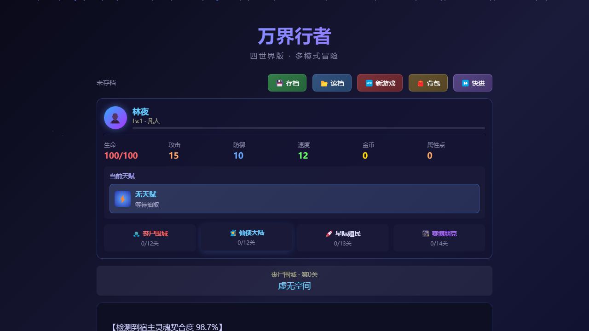
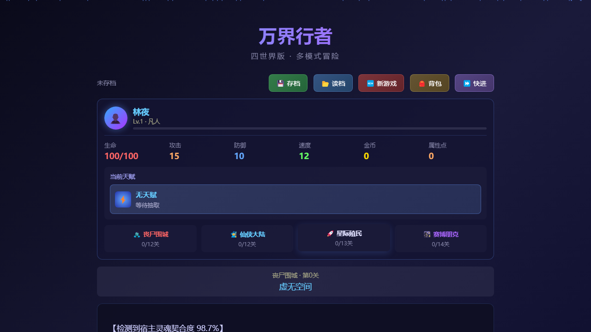

# 🌌 万界行者 — Realm Walker

> 一款纯前端文字冒险 RPG 网页游戏，零框架依赖，单文件部署。

**[🎮 在线体验](https://berialli.github.io/wanjie-game/)**


---

## 🎯 游戏简介

《万界行者》是一款纯前端文字冒险RPG游戏。玩家扮演主角「林夜」，在系统精灵「零号」的引导下，穿越四个风格迥异的世界，完成冒险任务。每个世界拥有独立的剧情、角色和多模式关卡，支持战斗、解谜、寻物、潜行、营救、生存、交流、BOSS等多种游戏模式。

**游戏特色：**

- 四大世界：丧尸围城（12关）、仙侠大陆（12关）、星际殖民（13关）、赛博朋克（14关），共51关
- 九大关卡模式：战斗、解密、寻物、交流、救护、潜行、生存、BOSS、通关
- 天赋系统：8个等级（D/C/B/A/S/SS/SSS/超神）共24个天赋，每世界可抽3次，通关时可保留1个永久天赋，天赋效果可叠加
- 装备系统：武器、防具、饰品三个槽位，5种品质（普通/精良/稀有/史诗/传说）
- 背包系统：初始20格，可扩展至100格（5级扩容），支持消耗品、永久属性道具、Buff道具、NPC治疗道具
- 属性点系统：每升级获得3个自由分配点（每点+3对应属性）
- 快进模式：可跳过剧情打字效果，战斗自动攻击（优先天赋技）
- 多线剧情：关键选择影响后续故事走向

---

## ⚔️ 角色属性系统

### 基础属性

| 属性 | 说明 | 初始值 |
|------|------|--------|
| 生命值（HP） | 角色当前生命值，归零则战斗失败 | 100 |
| 攻击力（ATK） | 影响战斗中的伤害输出 | 15 |
| 防御力（DEF） | 减少受到的伤害 | 10 |
| 速度（SPD） | 影响先手判定、闪避概率 | 12 |

### 属性计算规则（六层叠加）

1. **基础值** = 初始值 + (等级 - 1) × 1（每升级全属性+1）
2. **分配点加成** = 已分配点数 × 3（每点+3对应属性）
3. **装备加成** = 所有已装备物品的属性值总和
4. **永久道具加成** = 背包中已使用的 permanent 道具属性值总和
5. **天赋加成** = 所有已激活天赋的效果叠加（百分比加成）
6. **临时Buff加成** = 当前生效的Buff道具属性值总和

### 等级称号（最高100级）

| 等级范围 | 称号 | 等级范围 | 称号 |
|----------|------|----------|------|
| 1 | 凡人 | 46-50 | 战王 |
| 2 | 准战士 | 51-55 | 准战神 |
| 3-5 | 1级战士 | 56-60 | 战神 |
| 6-9 | 2级战士 | 61-65 | 战神至尊 |
| 10-13 | 3级战士 | 66-70 | 万界行者 |
| 14-17 | 4级战士 | 71-75 | 万界之主 |
| 18-21 | 5级战士 | 76-80 | 万界至尊 |
| 22-25 | 6级战士 | 81-85 | 万界帝君 |
| 26-29 | 7级战士 | 86-90 | 万界神王 |
| 30-33 | 8级战士 | 91-95 | 万界创世 |
| 34-40 | 9级战士 | 96-99 | 万界主宰 |
| 41-45 | 准战王 | 100 | 万界至高 |

**升级规则：** 每升1级全属性自动+1，获得3个自由分配点；升级所需经验 = 当前等级 × 100；每次升级额外恢复10点生命值。

---

## ⚡ 天赋系统

### 8个品质等级 · 24个天赋

| 品质 | 天赋数 | 天赋列表 |
|------|--------|----------|
| **D级（基础）** | 5个 | 闪电反射（闪避+300%）、铁壁（防御+50%）、狂暴（攻击+80%）、感知（感知敌人）、恢复（每回合回3%生命） |
| **C级（进阶）** | 4个 | 剑意初现（攻击+20%额外伤害）、疾风步（闪避+30%）、生命汲取（攻击回15%生命）、铁拳（普攻+25%） |
| **B级（稀有）** | 3个 | 剑意无双（25%几率秒杀）、时空凝滞（敌人伤害-20%）、护体金光（致命伤害免疫一次） |
| **A级（史诗）** | 2个 | 因果律令（必定先手）、不死之身（首次死亡复活） |
| **S级（传说）** | 2个 | 万界共鸣（全属性+30%）、命运逆转（伤害翻倍） |
| **SS级（超凡）** | 3个 | 混沌吞噬（吞噬敌人10%属性永久加成）、时空断裂（攻击附带无视防御的时空伤害）、不灭意志（复活且全属性+50%） |
| **SSS级（神话）** | 3个 | 万象归一（所有天赋效果翻倍+全属性+60%）、逆天改命（30%概率完全免疫伤害）、无尽轮回（死亡自动复活，恢复80%生命，每场限1次） |
| **超神级** | 3个 | 万界主宰（全属性+100%+必定暴击）、创世之光（每次攻击造成敌人最大生命15%真实伤害）、超维感知（闪避90%+闪避反伤200%攻击力） |

### 天赋机制

1. 每个世界在不同关卡触发3次天赋抽取
2. 抽取的天赋为临时天赋，在该世界内有效
3. 天赋效果可叠加，多个天赋同时生效
4. 世界通关后可选择保留一个天赋永久生效
5. 已保留的天赋在后续所有世界中持续生效
6. 天赋按世界难度递进抽取不同品质等级

---

## 🛡️ 装备系统

### 装备槽位与品质

| 品质 | 颜色 | 武器示例 | 防具示例 | 饰品示例 |
|------|------|----------|----------|----------|
| 普通（Common） | 灰白色 | 生锈铁棍（ATK+5） | 皮甲（DEF+3） | 疾风靴（SPD+5） |
| 精良（Uncommon） | 绿色 | 医用匕首（ATK+8） | 防弹衣（DEF+8） | 夜视仪（SPD+8） |
| 稀有（Rare） | 蓝色 | 等离子步枪（ATK+15） | 纳米战甲（DEF+15） | 神经芯片（SPD+12） |
| 史诗（Epic） | 紫色 | 神经刃（ATK+22） | 赛博护甲（DEF+22） | 时空回路（SPD+18） |
| 传说（Legendary） | 金色 | 虚空之剑（ATK+35） | 虚空之盾（DEF+30） | 虚空之戒（SPD+25） |

**获取方式：** 关卡剧情奖励 / BOSS战掉落（80%概率）/ 战斗胜利消耗品掉落（35%概率）

---

## 🎒 背包与道具系统

### 背包扩容

| 等级 | 扩容后容量 | 所需金币 |
|------|-----------|----------|
| 1级 | 30格 | 200金币 |
| 2级 | 40格 | 500金币 |
| 3级 | 60格 | 1000金币 |
| 4级 | 80格 | 2000金币 |
| 5级 | 100格 | 5000金币 |

### 道具分类

| 类型 | 说明 | 示例 |
|------|------|------|
| 补血道具（heal） | 恢复生命值，战斗中不可用 | 小回复药(+30HP)、中回复药(+60HP)、大回复药(+120HP)、圣水(完全恢复) |
| Buff道具（buff） | 临时提升属性，持续5场战斗 | 力量药剂(ATK+5)、铁壁药剂(DEF+4)、疾风药剂(SPD+3) |
| 永久属性道具（permanent） | 永久增加属性值 | 攻击秘籍(ATK+3)、防御秘籍(DEF+3)、身法秘籍(SPD+2)、生命秘籍(HP+20) |
| NPC治疗道具（npc_heal） | 对NPC盟友使用恢复生命 | 急救包(恢复50HP)、万灵丹(恢复150HP) |

---

## ⚔️ 战斗系统

### 回合制战斗

1. 速度高的角色先行动
2. 拥有"因果律令"天赋时必定先手
3. 每回合可选择：攻击、防御、闪避、天赋技

| 操作 | 效果 |
|------|------|
| 攻击 | 对敌人造成伤害（攻击力 - 敌防御 + 随机波动） |
| 防御 | 受到伤害减少60%，同时结束自己的回合 |
| 闪避 | 有概率完全躲避敌人攻击（概率 = 40% + 速度/100） |
| 天赋技 | 释放2倍攻击力的强力技能，冷却3回合 |

### 敌人种类（16种 + 隐藏BOSS）

**丧尸围城：** 感染丧尸、奔跑丧尸、巨型丧尸、堕落者、变异丧尸、丧尸领主（BOSS）

**仙侠大陆：** 魔修弟子、妖兽、魔修长老、剑灵、魔道宗主（BOSS）

**星际殖民：** 外星生物、虫族女王（BOSS）

**赛博朋克：** 赛博改造人、超级AI（BOSS）

另有 **天劫雷云**（隐藏BOSS）。

---

## 🎲 关卡模式

| 模式 | 图标 | 说明 |
|------|------|------|
| 战斗 | ⚔️ | 与敌人正面对决 |
| 解密 | 🧩 | 破解机关谜题（字谜/密码） |
| 寻物 | 🔍 | 在场景中搜寻关键物品，注意避开陷阱 |
| 交流 | 💬 | 与其他角色对话获取信息 |
| 救护 | 🏥 | 限时救治伤员获取奖励 |
| 潜行 | 👤 | 悄无声息穿越危险区域，避免被发现 |
| 生存 | 🏕️ | 在恶劣环境中坚持多波攻击 |
| BOSS | 👹 | 迎战强大的BOSS |
| 通关 | 🏆 | 完成当前世界的最终挑战 |

---

## 🌍 四大世界详情

### 世界一：丧尸围城（12关 · 难度D）

末日废土风格，丧尸横行。适合新手熟悉游戏机制。

- 天赋抽取：第1关（D级）、第5关（C级）、第9关（B级）
- BOSS：丧尸领主（200HP / 30ATK / 15DEF / 10SPD）

### 世界二：仙侠大陆（12关 · 难度C）

修仙世界，魔修入侵。引入更强的敌人和解谜元素。

- 天赋抽取：第1关（D级）、第5关（B级）、第9关（A级）
- BOSS：魔道宗主（250HP / 35ATK / 18DEF / 12SPD）

### 世界三：星际殖民（13关 · 难度B）

星际探索，虫族入侵。包含多种小游戏模式。

- 天赋抽取：第1关（C级）、第5关（B级）、第10关（A级）
- BOSS：虫族女王（800HP / 45ATK / 25DEF / 20SPD）

### 世界四：赛博朋克（14关 · 难度A）

赛博都市，企业对抗。最高难度，多种模式混合。

- 天赋抽取：第1关（C级）、第5关（B级）、第9关（A级）
- BOSS：超级AI（600HP / 40ATK / 30DEF / 25SPD）

---

## ⏩ 快进模式

点击顶部栏的「⏩ 快进」按钮可切换快进模式：

- 剧情文字瞬间显示，跳过打字机效果
- 战斗中自动执行攻击操作（优先使用天赋技）
- 战斗回合间隔大幅缩短（1秒→0.1秒）

---

## 💾 存档系统

- **自动存档**：每次世界通关或进入系统空间时自动保存
- **手动存档**：支持多存档槽位，可自定义存档名称
- **读档**：支持从任意存档继续游戏
- **新游戏**：清除当前进度重新开始
- **版本兼容**：新旧版本存档自动兼容，新增字段有默认值

---

## 🛠️ 技术实现

- **纯前端**：HTML5 + CSS3 + JavaScript，无任何框架依赖
- **单文件部署**：所有代码合并为一个 `index.html`，扔到任何静态服务器即可运行
- **模块化源码**：开发时按功能拆分为独立 JS 模块，构建时合并

### 源码结构

```
js/
├── core.js          # 核心状态管理（等级/属性/背包/装备/道具/背包扩容）
├── battle.js        # 战斗系统（回合制战斗/24个天赋效果实现）
├── ui.js            # UI系统（界面渲染/打字机效果/背包扩容按钮）
├── stages.js        # 关卡引擎（关卡加载/世界选择/天赋抽取与保留）
├── save.js          # 存档系统（存档/读档/自动存档/旧版兼容）
├── minigames.js     # 小游戏系统（解谜/寻物/潜行/营救/生存）
├── stages-data.js   # 关卡数据（51关剧情内容/双线分支/世界常量）
├── data-enemies.js  # 敌人数据（16种敌人/4个世界BOSS）
└── talent-pool.js   # 天赋池（8个品质等级D~超神/24种天赋）
```

---

## 🚀 快速开始

### 在线玩

直接访问 👉 [在线体验地址](https://berialli.github.io/wanjie-game/)

### 本地运行

```bash
# 克隆仓库
git clone https://github.com/berialli/wanjie-game.git

# 打开游戏（任选一种方式）
# 方式1：直接用浏览器打开 index.html
# 方式2：本地服务器
cd wanjie-game
npx serve .
```

---

## 🎮 游戏截图

> 游戏采用全中文界面，沉浸式文字冒险体验。

<!-- 截图占位，添加后替换 -->
<!--  -->
<!--  -->
<!--  -->
<!--  -->

---

## 📋 版本历史

### v1.1.0 (2026-04-28)
- 新增 SS / SSS / 超神 三个天赋等级（9 个新天赋）
- 新增背包 5 级扩容系统（20→100 格）
- 修复天赋选取显示和 Emoji 渲染问题

---

## 📄 许可证

[MIT License](./LICENSE) — 允许自由使用、修改和分发本源代码，但必须保留原始版权声明和来源说明。二次分发或衍生作品应在显著位置注明原始来源。

技术实现基于纯前端 HTML5 + CSS3 + JavaScript，无任何外部框架依赖。Emoji 图标使用系统原生开源资源。

---

*祝你在万界中旅途愉快！*
